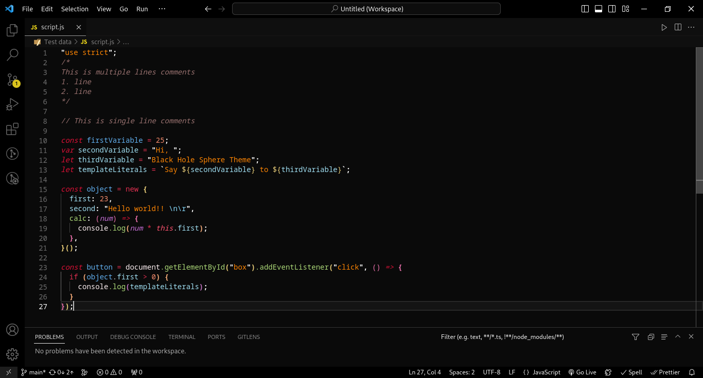

<h1 align="center">Black Hole Sphere Theme 🪐</h1>
<h3 align="center">
    This is a dark theme for Visual Studio code
</h3>

## Installation

1. Open VS Code ‣ Extensions ‣ Search for 'Black Hole Sphere Theme' ‣ Install
2. Command Palette (Ctrl + Shift + P) ‣ Black Hole Sphere Theme: select theme

### Preview

   
